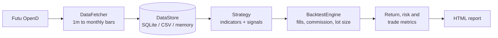

<a href="https://github.com/billpwchan"></a>

# strategy_powerbacktest

A bar-by-bar backtesting framework for strategies traded through [Futu OpenAPI](https://openapi.futunn.com/). It pulls bars straight from Futu OpenD, runs them through a pluggable strategy class with commission charged on every fill and board-lot position sizing, and writes an HTML report with return, risk and trade statistics.

基於 Futu OpenAPI 的逐根 K 線回測框架：直接從 OpenD 取數，每筆成交計入佣金並按每手股數下單，輸出完整的收益、風險與交易指標報告。

[](LICENSE)
[](requirements.txt)

## How a backtest runs



## What you get in the report

| Group | Metrics |
|:--|:--|
| Returns | Total and annualised return, Sharpe ratio, monthly return table, realised and floating PnL |
| Risk | Maximum drawdown and its duration, Sortino ratio, volatility, value at risk, beta against a benchmark |
| Trades | Win rate, profit factor, per-symbol results |

## Quick start

Requirements: Python 3.8+, and [Futu OpenD](https://www.futunn.com/download/openAPI) running and logged in (a demo account works). OpenD listens on `localhost:11111` by default.

```bash
git clone https://github.com/billpwchan/strategy_powerbacktest.git
cd strategy_powerbacktest
python -m venv venv
source venv/bin/activate        # Windows: venv\Scripts\activate
pip install -r requirements.txt

python main.py --strategy macd --symbols HK.00700 HK.09988 \
  --start-date 2023-01-01 --end-date 2023-12-31 \
  --initial-capital 100000 --commission 0.001 --timeframe DAY
```

The run ends by logging the path of `strategy_backtest_report.html`.

| Option | Meaning |
|:--|:--|
| `--strategy` | `macd`, `ma_cross`, `btse` or `leg` |
| `--symbols` | One or more Futu codes, e.g. `HK.00700 US.AAPL` |
| `--start-date`, `--end-date` | `YYYY-MM-DD` |
| `--initial-capital`, `--commission` | Starting cash and commission rate (`0.001` = 0.1%) |
| `--timeframe` | `1M`, `3M`, `5M`, `15M`, `30M`, `60M`, `2H`, `4H`, `DAY`, `WEEK`, `MON` |

Anything not passed on the command line falls back to `config.yaml`, which also holds the OpenD connection, storage backend and logging settings. `backtest.slippage` is read from the config but not yet applied to fills, so results assume execution at the bar price.

## Writing a strategy

Subclass `BaseStrategy`, compute indicators, and return a signal series (`1` buy, `-1` sell, `0` hold):

```python
import pandas as pd
from src.strategy.base_strategy import BaseStrategy


class MovingAverageCrossStrategy(BaseStrategy):
    def __init__(self, parameters=None):
        parameters = parameters or {}
        self.short_window = parameters.get("short_window", 20)
        self.long_window = parameters.get("long_window", 50)
        super().__init__(parameters)

    def generate_signals(self, data: pd.DataFrame) -> pd.Series:
        short = data["close"].rolling(self.short_window).mean()
        long = data["close"].rolling(self.long_window).mean()
        above = (short > long).astype(int)
        return above.diff().fillna(0)  # 1 on golden cross, -1 on death cross
```

Then add it to `StrategyFactory._strategies` in `src/strategy/strategy_factory.py` so `--strategy` can find it. The full version of this example, with parameter validation and warm-up handling, is in `src/strategy/moving_average_strategy.py`.

## Project layout

```
src/
├── data/        # DataFetcher (Futu OpenD) and DataStore
├── strategy/    # BaseStrategy, built-in strategies, factory
├── engine/      # BacktestEngine, runner, metrics, report builder
├── templates/   # HTML report templates
└── utils/       # CLI, config, timeframe resampling, logging
tests/           # pytest suite
config.yaml      # defaults for connection, costs, storage
main.py          # entry point
```

Run the tests with `pytest`.

## Part of a three-repo trading stack

**[futu_tick_downloader](https://github.com/billpwchan/futu_tick_downloader)** (tick capture) → **strategy_powerbacktest** (backtesting) → **[futu_algo](https://github.com/billpwchan/futu_algo)** (live trading)

Built by [Bill Chan](https://github.com/billpwchan). Licensed under Apache 2.0.

> [!WARNING]
> For education and research only. Backtest results do not predict live performance. Use at your own risk; the author takes no responsibility for trading results.
