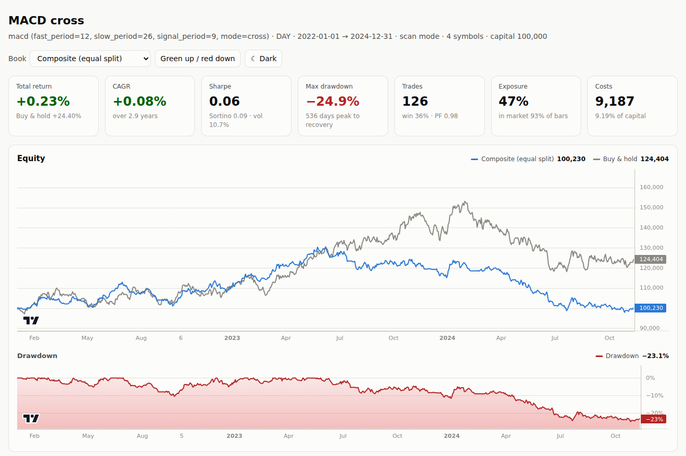
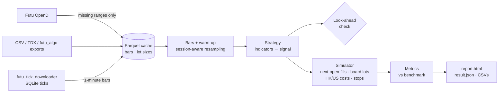

<a href="https://github.com/billpwchan"></a>

# strategy_powerbacktest

A bar-level backtester for Hong Kong and US equities on [Futu OpenAPI](https://openapi.futunn.com/) data. It caches K-lines locally so each symbol costs Futu quota once, fills orders at the next bar's open in whole board lots, charges HK costs line by line on the schedule in force on the trade date, checks every strategy for future functions, and writes a single-file HTML report that works offline.

基於 Futu OpenAPI 的港美股 K 線回測框架：K 線本地快取，每隻股票只消耗一次歷史 K 線額度；信號於收盤產生、下一根開盤成交，按每手股數整手下單；港股印花稅、交易徵費、交收費按成交日期適用的費率逐項計算；每次回測自動檢查未來函數；輸出可離線打開的單檔 HTML 報告。

[](LICENSE)
[](pyproject.toml)
[](.github/workflows/ci.yml)



## How a backtest runs



## Quick start

Requirements: Python 3.11+, and [Futu OpenD](https://www.futunn.com/download/openAPI) running and logged in for the first data download. After that, `--offline` runs entirely from the cache.

```bash
git clone https://github.com/billpwchan/strategy_powerbacktest.git
cd strategy_powerbacktest
python -m venv .venv && source .venv/bin/activate   # Windows: .venv\Scripts\activate
pip install -e .

pbt init config.local.yaml          # copy of configs/example.yaml to edit
pbt run -c config.local.yaml        # fetches data, runs, writes reports/<strategy>_<tf>_<time>/report.html
pbt run -c config.local.yaml --offline --symbols HK.00700 -p fast_period=10 --open
```

The run prints a summary table and the path of the report. Every CLI flag overrides the config, and `--set dotted.key=value` reaches any field, for example `--set risk.stop_loss=0.08`.

| Command | What it does |
|:--|:--|
| `pbt run` | Run a backtest and write `report.html`, `result.json`, `summary.csv`, `equity.csv`, `trades.csv`, `fills.csv`, `config.yaml` |
| `pbt optimize` | Grid search with an in/out-of-sample split or an anchored walk-forward |
| `pbt data fetch` | Download the configured symbols into the cache without running anything |
| `pbt data import` | Load CSV/Parquet bars (Futu, futu_algo's cache, TDX exports with Chinese headers) |
| `pbt data import-ticks` | Build 1-minute bars from `futu_tick_downloader` SQLite files |
| `pbt data list` · `pbt quota` | Show cached series and lot sizes · show the Futu history K-line quota |
| `pbt strategies` | List strategies and their parameters (`--json` for the full schema) |
| `pbt report <dir>` | Re-render `report.html` from a saved `result.json` |

## What the numbers assume

These are the defaults. Each one is a config field, and the report's Assumptions panel records what a run actually used.

- **Timing.** The signal is computed on bar t's close and the order fills at bar t+1's open. `execution.fill: close` fills on the signal bar the way TDX's built-in backtest does; it is optimistic and labelled as such.
- **Board lots and cash.** Quantities are whole lots from Futu's lot size (overridable per symbol). Buys shrink lot by lot until price plus fees fit the budget, so cash never goes negative.
- **Slippage.** One adverse tick per fill by default, using the HKEX spread table in force on the bar's date. The 2025-08-04 and 2026-08-03 tick reductions are built in. Fill prices never leave the bar's high-low range.
- **HK costs.**
  - Statutory, each on the rate in force on the trade date:
    - Stamp duty: 0.13% from 2021-08-01 to 2023-11-16, 0.1% otherwise, rounded up to the next dollar; ETFs exempt.
    - SFC levy 0.0027% and AFRC levy 0.00015%.
    - HKEX trading fee: 0.00565%, or 0.005% plus the HK$0.50 tariff before 2023.
    - Settlement fee: 0.0042% from 2025-06-30; before that 0.002% with a HK$2 minimum and HK$100 maximum.
  - Broker: Futu's fixed plan, 0.03% commission (HK$3 minimum) plus a HK$15 platform fee per order. Set `costs.hk.commission_rate: 0` while a zero-commission promotion runs.
  - Example: a HK$20,000 round trip costs about 0.37%.
- **US costs.** Futu's per-share commission and platform fee with their minimums, plus settlement fee and the sell-side SEC Section 31 fee and FINRA TAF, each by date.
- **Prices.** Forward-adjusted (qfq) by default, like TDX. When a new dividend changes the adjustment, the cache detects it and re-downloads the series instead of mixing old and new adjustments.
- **Entries.** By default a symbol is not bought mid-signal at the start of the test or straight after a stop-out; the signal has to reset first.
- **Risk exits.** Optional stop loss, trailing stop and take profit fill intrabar at the level, or at the open when the bar gaps through either one. If a stop and a target are both inside one bar, the stop is assumed to hit first. `max_holding_bars: N` exits at the next open after N bars have been held.
- **Modes.**
  - `scan` (default): simulates each symbol alone with the full capital, and answers "which stocks does this strategy work on". The Composite book averages them.
  - `portfolio`: shares one cash balance, sized by `equal_weight` across `max_positions`, a fixed value, fixed lots, a percentage of equity, or all-in.
- **Metrics.**
  - Annualisation is measured from the bars actually traded, not a fixed 252, so intraday Sharpe ratios are right.
  - Drawdown duration runs from the peak to full recovery.
  - Beta, alpha and information ratio are measured against `backtest.benchmark` (e.g. `HK.800000`, the Hang Seng Index) or against buy and hold.
  - Every formula is in [`analytics/metrics.py`](src/powerbacktest/analytics/metrics.py).

## Strategies

| Name | Rule | Notes |
|:--|:--|:--|
| `macd` | Buy when DIF crosses above DEA, sell on the reverse cross | Same rule as futu_algo's `MACD_Cross`. `mode: state` holds while DIF > DEA |
| `ma_cross` | Short MA crosses the long MA | `ma_type: sma \| ema`, `mode: cross \| state` |
| `kdj` | K turns up through D below the oversold level; the mirror rule sells | futu_algo `KDJ_Cross` rules on TDX KDJ (`SMA(RSV,3,1)`) |
| `rsi` | RSI drops through the lower level (buy) or rises through the upper level (sell) | futu_algo `RSI_Threshold` rules on TDX RSI |
| `btse` | Strong DMI down-move (MDI > 25 > PDI) then a ZIG up-turn; exit on a ZIG down-turn | See the ZIG note below |
| `leg` | Two-bar reversal pattern | See the LEG note below |

**ZIG.** TDX's `ZIG` redraws its last leg as new bars arrive, so TDX backtests of ZIG formulas use future data. By default `btse` evaluates ZIG point-in-time: on every bar it recomputes the formula on the history up to that bar, which is what you would have seen live. `zig_mode: tdx` reproduces the repainting version for comparison; the look-ahead check flags it and the report shows a warning.

**LEG.** The original LEG formula isn't in the repository. `leg` keeps only the logic the old port actually traded, the two-bar reversal pattern, and drops indicators it computed but never used.

## Writing a strategy

A strategy returns indicator columns and a signal per bar: `1` = be long, `0` = be flat, `NaN` = no change. TDX functions keep TDX semantics, so formulas port line by line.

```python
import pandas as pd
from pydantic import Field
from powerbacktest.strategy import Strategy, StrategyParams, events, register
from powerbacktest.strategy.tdx import CROSS, MA, LLV, REF


class Params(StrategyParams):
    n: int = Field(20, ge=2)
    m: int = Field(60, ge=3)


@register
class Breakout(Strategy):
    name = "breakout"
    title = "MA trend with pullback entry"
    Params = Params

    def warmup_bars(self) -> int:
        return self.params.m

    def indicators(self, bars: pd.DataFrame) -> pd.DataFrame:
        c = bars["close"]
        return pd.DataFrame(
            {
                "fast": MA(c, self.params.n),
                "slow": MA(c, self.params.m),
                "low20": LLV(bars["low"], 20),
            },
            index=bars.index,
        )

    def signals(self, bars, ind):
        buy = CROSS(ind["fast"], ind["slow"]) & (bars["close"] > REF(ind["low20"], 1) * 1.05)
        sell = CROSS(ind["slow"], ind["fast"])
        return events(buy, sell)
```

Point `backtest.strategy_paths` at the file or directory and use `--strategy breakout`, or pass `--strategy path/to/file.py:Breakout`. Every run recomputes the strategy on truncated history and warns if any value at bar t changes when later bars are added. `strategy.decide_last(window)` returns the decision for the latest bar, the same value the backtest used, which is how a live bot such as futu_algo can call the same class.

## Data

Bars are cached under `data/bars/<KTYPE>/<adjust>/<MARKET>/<code>.parquet`, with a JSON sidecar recording the date range already requested.

- **Fetching.** Only missing ranges go to OpenD, paged 1,000 bars at a time within Futu's 60-requests-per-30-seconds limit. Bars for a period still in progress (today, this week, this month) are never cached.
- **Quota.** Futu counts each new symbol against the history K-line quota (100 to 2,000 symbols depending on account tier, reset every 7 days since OpenD 10.3). Fetching the same symbol again inside the window is free, and the manager refuses to start a new symbol when no quota remains. `pbt quota` shows the current state.
- **Intraday timeframes.** Futu serves 1/3/5/15/30/60-minute bars natively. Any other multiple (`2H`, `4H`, `90M`, `10M`) is built from the largest native divisor, in chunks anchored to each trading session. A bar never spans the HK lunch break, so `4H` on HK gives one morning and one afternoon bar.
- **Offline data.** `pbt data import` and `import-ticks` fill the cache from files: TDX exports, futu_algo's `data/<code>/*.parquet`, or futu_tick_downloader's daily SQLite files.

## Optimisation

```bash
pbt optimize -c config.local.yaml --grid fast_period=8:16:2 --grid slow_period=20,26,34 \
  --split 2024-01-01 --min-trades 5          # rank in-sample, report out-of-sample next to it
pbt optimize -c config.local.yaml --grid fast_period=8:16:2 --folds 4   # anchored walk-forward
```

Results go to `reports/optimize_<strategy>/optimize.csv`. Walk-forward also writes the stitched out-of-sample equity curve. Indicators are warmed up on bars before each window, so a test slice trades from its first day without seeing its own data in advance.

## Project layout

```
src/powerbacktest/
├── data/        Futu source (paging, rate limit, quota), Parquet cache, resampling, importers
├── market/      instruments and sessions, HK/US cost schedules, HK spread table
├── strategy/    Strategy API, TDX function library, look-ahead check, built-in strategies
├── engine/      simulator, scan/portfolio runner, trade and fill records
├── analytics/   metric definitions
├── report/      result.json payload, single-file HTML report (Lightweight Charts inlined)
├── optimize.py  grid search, split and walk-forward
└── cli.py       the `pbt` command
configs/example.yaml    every setting, commented
tests/powerbacktest/    pytest suite: hand-computed fees and fills, accounting invariants, CLI end to end
docs/ARCHITECTURE.md    design decisions, assumptions and known limitations
```

The pre-1.0 implementation (`main.py`, `src/{data,engine,strategy,utils}`) has been removed; [CHANGELOG.md](CHANGELOG.md) records why it was replaced, and it remains in the git history before 1.0.

## Development

```bash
pip install -e ".[dev]"
pytest                      # 88 tests
ruff check . && ruff format --check . && mypy
```

## Part of a three-repo trading stack

**[futu_tick_downloader](https://github.com/billpwchan/futu_tick_downloader)** (tick capture) → **strategy_powerbacktest** (backtesting) → **[futu_algo](https://github.com/billpwchan/futu_algo)** (live trading)

Built by [Bill Chan](https://github.com/billpwchan). Licensed under Apache 2.0. Charts use [TradingView Lightweight Charts™](https://www.tradingview.com/lightweight-charts/) (Apache 2.0).

> [!WARNING]
> For education and research only. Backtest results do not predict live performance. Use at your own risk; the author takes no responsibility for trading results.
